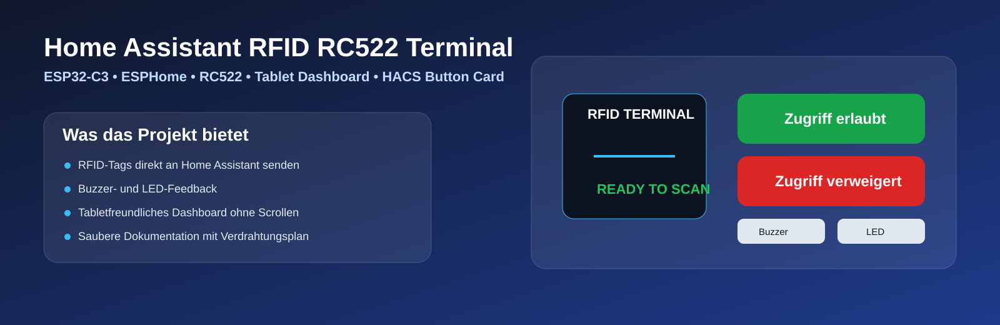

# Home Assistant RFID RC522 Terminal

A compact RFID access terminal based on an **ESP32-C3**, **MFRC522/RC522** and **ESPHome**, integrated directly into **Home Assistant**.

The project forwards RFID tags to Home Assistant as tag events and provides buzzer, LED and test functions. The included tablet dashboard uses an animated scan panel and separate sections for terminal status, test actions and controls.

[Deutsche Version](README.md)

> **Security:** Keep API keys, OTA passwords and Wi-Fi credentials in `secrets.yaml`. Never commit real credentials to a public repository.

## Project overview

## Features

- ESP32-C3 + RC522 via SPI
- forwards RFID scans to Home Assistant
- RTTTL buzzer output
- Home Assistant switch to enable/disable buzzer
- optional status LED
- online/offline indication
- test actions for OK, deny, melody and alarm
- animated tablet UI using `custom:button-card`
- compact layout designed to avoid vertical scrolling

## Hardware

- ESP32-C3 DevKitM-1 or compatible board
- RC522 RFID module
- passive piezo buzzer
- optional LED with 220–330 Ω resistor
- jumper wires
- USB cable
- RFID tag/card for testing

## Wiring

| RC522 | ESP32-C3 |
|---|---|
| SCK | GPIO9 |
| MISO | GPIO5 |
| MOSI | GPIO6 |
| SDA / SS | GPIO7 |
| RST | GPIO10 |
| 3.3 V | 3.3 V |
| GND | GND |

Additional outputs:

| Function | ESP32-C3 |
|---|---|
| Buzzer + | GPIO8 |
| Buzzer − | GND |
| LED anode | GPIO2 via 220–330 Ω |
| LED cathode | GND |

**Power the RC522 from 3.3 V only.** A 5 V supply can damage the reader.

See [docs/WIRING.md](docs/WIRING.md) for the full wiring guide.

## Quick start

1. Add `esphome/rfid-rc522.yaml` to ESPHome.
2. Copy the required values from `esphome/secrets.example.yaml` into your own `secrets.yaml`.
3. Wire the hardware according to the diagram.
4. Flash the ESP32-C3.
5. Add the ESPHome device to Home Assistant.
6. Enable **Allow the device to perform Home Assistant actions** in the ESPHome integration so `homeassistant.tag_scanned` can work.
7. Install **Button Card** through HACS.
8. Optionally install **card-mod**.
9. Reload the Home Assistant frontend.
10. Add the three YAML cards from `home-assistant/` to three dashboard sections.
11. Adjust entity IDs if Home Assistant generated different names.

See [docs/INSTALLATION_EN.md](docs/INSTALLATION_EN.md) for details.

## Roadmap

Planned additions include last tag, last scan timestamp, scan counter, access status, user names, admin mode, alarm mode, relay output and event history.

## Compatibility / syntax

The examples use the current ESPHome `api: actions:` syntax and Home Assistant dashboard `perform-action` syntax.

Official documentation:

- ESPHome Native API: https://esphome.io/components/api/
- ESPHome RC522: https://esphome.io/components/binary_sensor/rc522/
- Home Assistant Dashboard Actions: https://www.home-assistant.io/dashboards/actions/

## License

MIT License. See [LICENSE](LICENSE).
