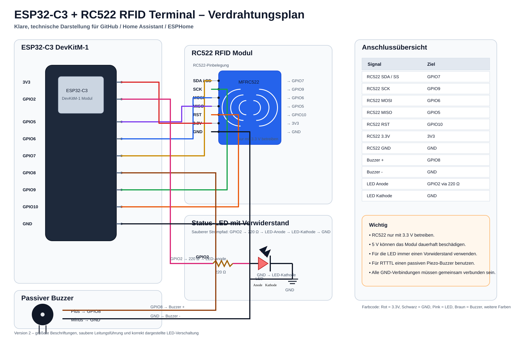
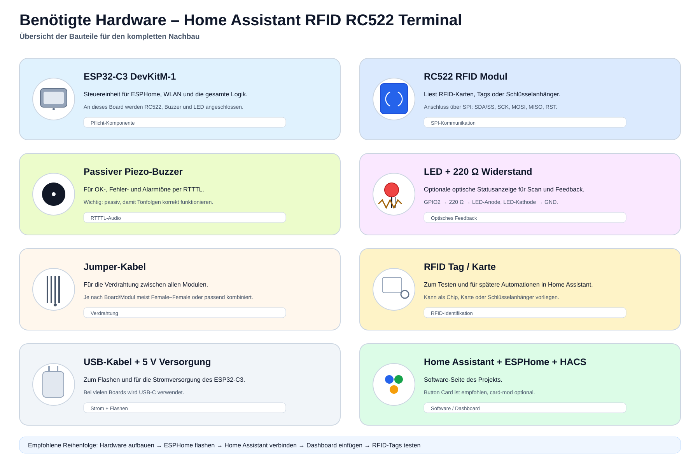
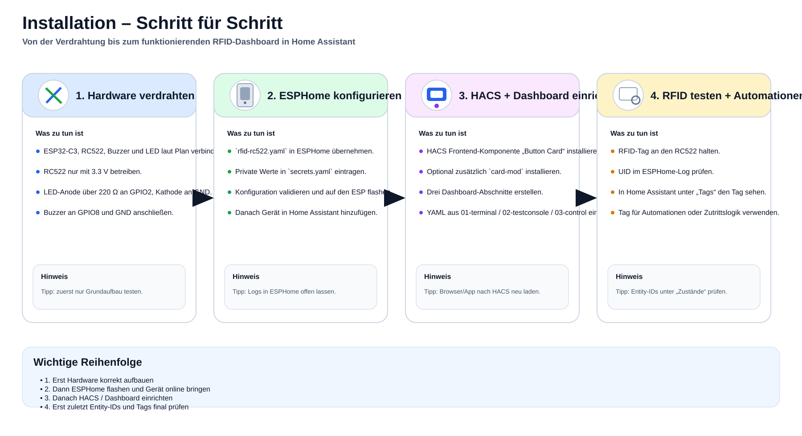

# Wiring / Verdrahtung

## RC522 → ESP32-C3

| RC522 Pin | ESP32-C3 Pin | Beschreibung |
|---|---|---|
| 3.3V | 3.3V | Versorgung |
| GND | GND | Masse |
| SCK | GPIO9 | SPI Clock |
| MISO | GPIO5 | SPI MISO |
| MOSI | GPIO6 | SPI MOSI |
| SDA / SS | GPIO7 | SPI Chip Select |
| RST | GPIO10 | Reset |

## Zusätzliche Ausgänge

| Funktion | GPIO |
|---|---|
| passiver Buzzer + | GPIO8 |
| passiver Buzzer − | GND |
| LED Anode | GPIO2 über 220–330 Ω |
| LED Kathode | GND |

## Hinweise

- RC522 **nur mit 3,3 V** versorgen.
- Bei externer LED immer einen Vorwiderstand verwenden, typischerweise 220–330 Ω.
- Der Buzzer muss für RTTTL ein **passiver Piezo-Buzzer** sein. Ein aktiver Buzzer kann keine Melodien wiedergeben.
- Falls dein ESP32-C3-Board GPIO2 anderweitig nutzt, `status_led` in der ESPHome-YAML auf einen freien GPIO ändern.
- Bei abweichender Board-Variante die Pinbelegung des konkreten ESP32-C3-Boards prüfen.

## Benötigte Hardware

## Ablauf

